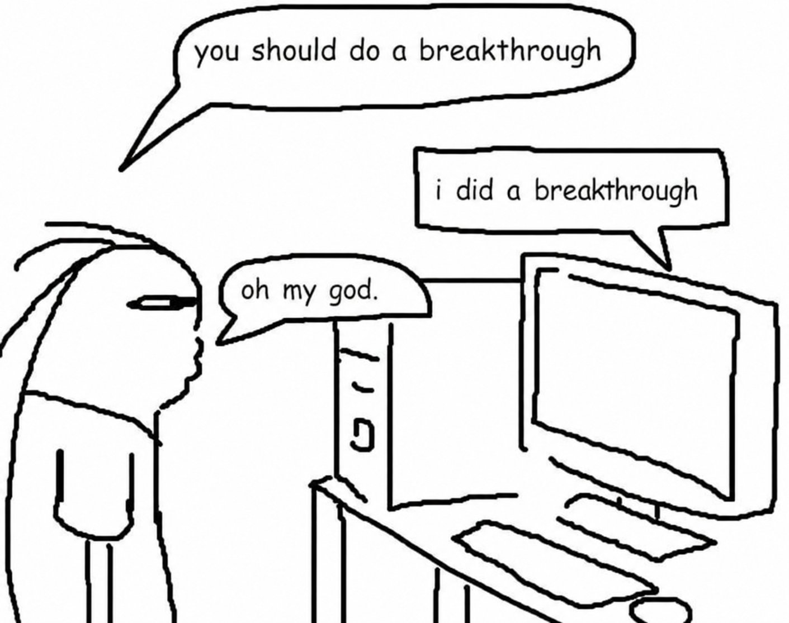

# Do a Breakthrough



On July 22, 2026, [Dmitry Rybin](https://x.com/DmitryRybin1) posted a blunt
[update on X](https://x.com/DmitryRybin1/status/2079904005652893709):
“Dinitz-Garg-Goemans conjecture is false. This graph theory problem was open for
~30 years.”

The counterexample came out of a chat with GPT-5.6 Pro. Rybin had started by
asking it to “do a breakthrough” and find a structured counterexample. When the
model stalled, he kept pushing for a complete, unconditional result.

He pointed a strong model at a specific open problem, gave it time, and refused
to accept partial progress. We may be underusing the models we already pay for.

`do-a-breakthrough` turns that method into a reusable agent skill. It helps
anyone choose a tractable open problem, define what would count as a complete
proof or disproof, keep several research routes alive, attack weak lemmas, and
audit any candidate result before calling it a breakthrough.

You do not need a mathematical background. Install the skill, name a problem or
an area that interests you, and let your ChatGPT, Claude, or coding agent work
through the research loop. Spend the usage you were going to waste on a shot at
something unsolved.

## Install

```sh
npx skills add https://github.com/ohong/do-a-breakthrough
```

## Use

```text
Use $do-a-breakthrough to try to solve [a specific problem], find an unsolved problem in [number theory or another niche], or choose one for me.
```

AI can produce convincing but false mathematics or mistake an old result for a
new one. Get an independent expert to check any claimed proof before you publish
or announce it.

Method inspired by [Shouqiao Wang](https://x.com/Qiaoqiao2001/status/2080003441821163958)
and [Dmitry Rybin](https://x.com/DmitryRybin1/status/2079904005652893709).

[Contribute](CONTRIBUTING.md) · [MIT License](LICENSE)
